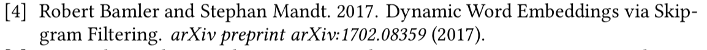
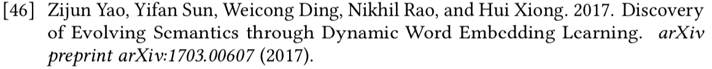
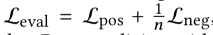
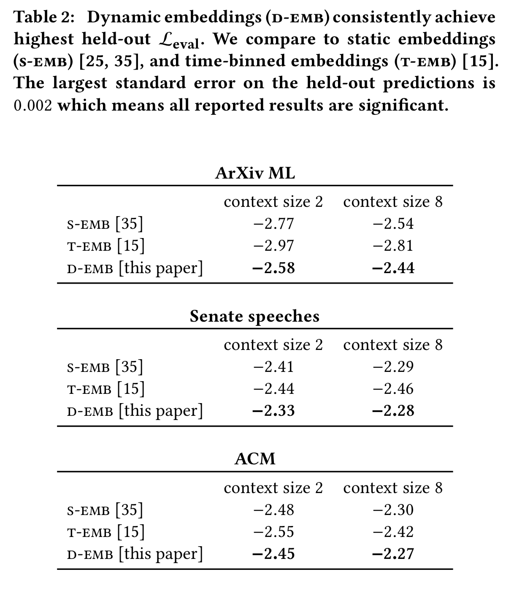
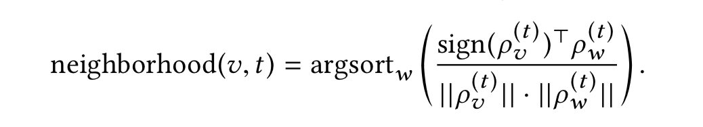
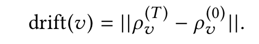
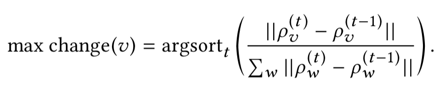
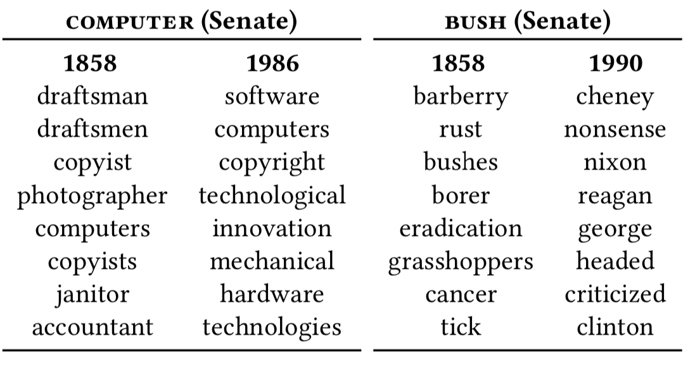
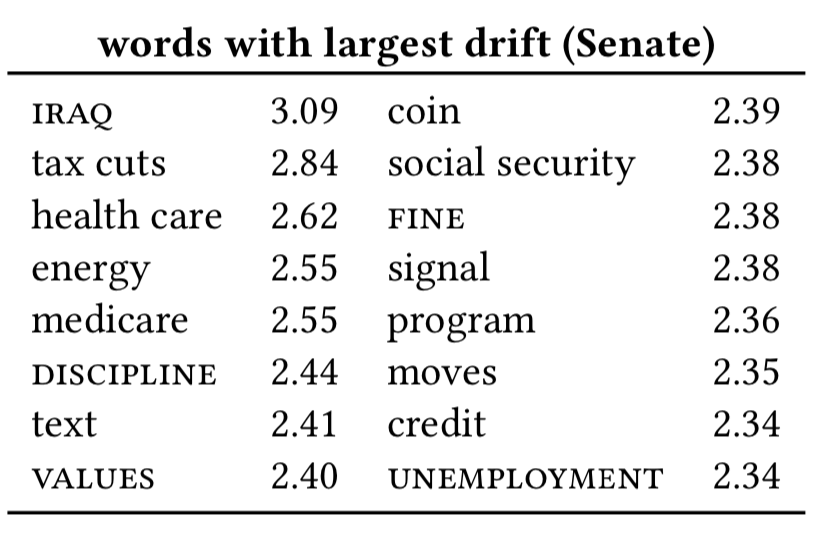
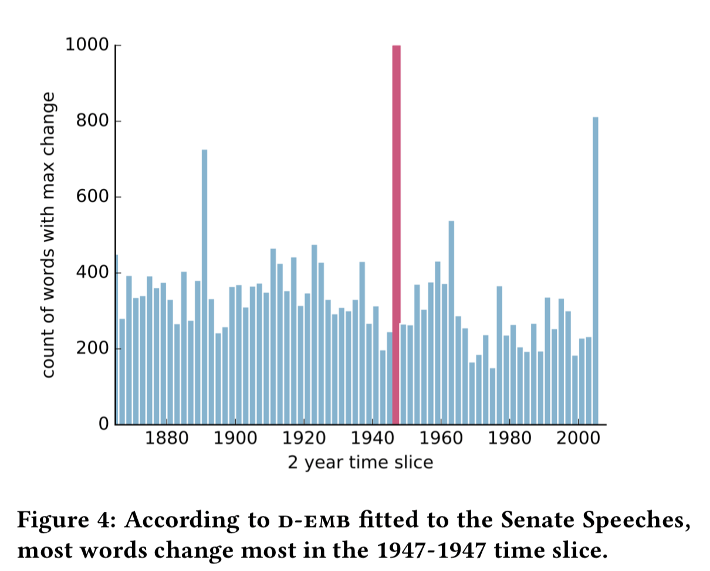

### [Review] Dynamic Embeddings for Language Evolution (M. Rudolph & D. Blei, 2018)
@snap[south-east]
##### TANG, Linyuan
##### 2019.05.17
@snapend
<!-- page main -->
---
@snap[north-west span-100]
#### 1. Introduction
@ul
- [PURPOSE] dynamic embeddings (D-EMB) analyze documents that span many years, where the way words are used changes over the course of the collection
- [RESULT] D-EMB provide better predictive performance than classical embeddings and capture interesting patterns about how language changes
@ulend
@snapend
<!-- page intro 1 -->
---
@snap[north-west span-100]
#### 1. Introduction
@ul
- build on *exponential family embeddings*
  - include dynamics into the *Bernoulli embedding model*
- cast the embedding vector as a latent variable that drifts via a Gaussian random walk
- when fit to data, the D-EMB capture how the representation of each word drift from slice to slice (one per year)
@ulend
@snapend
<!-- page intro 2 -->
---

---
@snap[north-west span-100]
#### 1.1 Exponential Family Embeddings (M. Rudolph et al., 2016)
An EFE is a conditional model. It has three ingredients:
@ol
- the context
- the conditional distribution of each data point
- the parameter sharing structure
@olend
@snapend
<!-- page intro 3 -->
---
@snap[north-west span-100]
### 2. related work
There have been several lines of research around capturing semantic shifts.
@ul
- use features such as POS tags and entropy; employ latent semantic analysis and temporal semantic indexing
- train a separate embedding for each time slice of the data; initialization or ad-hoc alignment techniques to stitch them together
@ulend
@snapend
<!-- page related work 1 -->
---
@snap[north-west span-100]
### 2. related work
In contrast, the representations in this work for dynamic embeddings are sequential latent variables.
Two similar models:

@snapend
<!-- page related work 2 -->
---
@snap[north-west span-100]
### 2. related work
Another area of related work is dynamic topic models.
@ul
- describe documents in terms of topics, which are distributions over the vocabulary, and then allows the topics to change
- some dynamic topic models also use a Gaussian random walk to capture drift in the underlying language model
@ulend
Topic models capture co-occurrence of words ate the document level and focus on heterogeneity. Word embeddings capture co-occurrence in terms of proximity in the text.
@snapend
<!-- page related work 3 -->
---
@snap[west span-100]
### 2. Dynamic embeddings
@snapend
<!-- page method -->
---
@snap[north-west span-100]
#### 2.1 Bernoulli embeddings for texts
@snapend
---
@snap[west span-100]
### 3. Dynamic embeddings
@snapend
<!-- page method -->
---?image=assets/img/proc.png&position=right&size=contain
@snap[west span-50]
### 3. Dynamic embeddings
@snapend
<!-- page method procedure -->
---?image=assets/img/algo.png&position=right&size=contain
@snap[north-west span-70]
### 3. Dynamic embeddings
@snapend
<!-- page method algorithm -->
---
@snap[west span-100]
### 3. Empirical study
@snapend
---
@snap[north-west span-100]
#### 3.1 Data
@snapend
@ul
- the U.S. Senate speeches from 1858 to 2009
- the history of computer science ACM abstracts from 1951 to 2014
- machine learning papers on the ArXiv from 2007 to 2015
@ulend
<!-- page data -->
---
@snap[north-west span-100]
#### 3.2 quantitative evaluation
@ul
- D-EMB improve over static embeddings (S-EMB) in terms of the conditional likelihood of held-out predictions
- perform better than embeddings trained on the individual time slices (T-EMB)
@ulend
@snapend
---
@snap[north-west span-100]
##### 3.2.1 evaluation metric
Given a model, each held-out position (validation or testing) is associated with a Bernoulli probability for each vocabulary term.

At that position, a better model assigns higher probability to the observed word and lower probability to the others.

@snapend
---
@snap[north-west span-100]
#### 3.2 quantitative evaluation
@snapend

---
@snap[north-west span-100]
#### 3.3 qualitative exploration
@snapend

---
@snap[north-west span-100]
##### 3.3.1 Embedding Neighborhood
@snapend

---
@snap[north-west span-100]
##### 3.3.2 Changing words with absolute drift
@snapend

---
@snap[north-west span-100]
##### 3.3.3 Changepoint analysis
@snapend

<!-- page last -->
