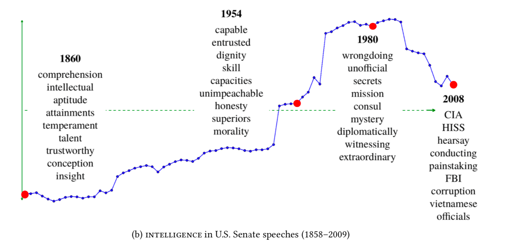

### [Review] Dynamic Embeddings for Language Evolution (M. Rudolph & D. Blei, 2018)
@snap[south-east]
##### TANG, Linyuan
##### 2019.05.17
@snapend
---
@snap[west span-100]
#### Dynamic Embeddings
@ul
- build on *exponential family embeddings* (a type of EFE)
  - include dynamics into the *Bernoulli embedding model*
- [PURPOSE] analyze documents that span many years, where the way words are used changes over the course of the collection
- [RESULT] D-EMB provide better fits than classical embeddings and capture interesting patterns about how language changes
@ulend
@snapend
---

---
@snap[west span-100]
#### Exponential Family Embeddings (M. Rudolph et al., 2016)
An EFE is a conditional model. It has three ingredients:
@ol
- the context
- the conditional distribution of each data point
- the parameter sharing structure
@olend
@snapend
---
@snap[west span-100]
### Datasets
@ul
- the U.S. Senate speeches from 1858 to 2009
- the history of computer science ACM abstracts from 1951 to 2014
- machine learning papers on the ArXiv from 2007 to 2015
@ulend
@snapend
---
@snap[west span-100]
### related work
There have been several lines of research around capturing semantic shifts.
@ul
- use features such as POS tags and entropy; employ latent semantic analysis and temporal semantic indexing
- train a separate embedding for each time slice of the data (initialization or ad-hoc alignment techniques to stitch them together)
@ulend
@snapend
---
@snap[west span-100]
### related work
In contrast, the representations in this work for dynamic embeddings are sequential latent variables.
@snapend
---
@snap[west span-100]
@snapend
